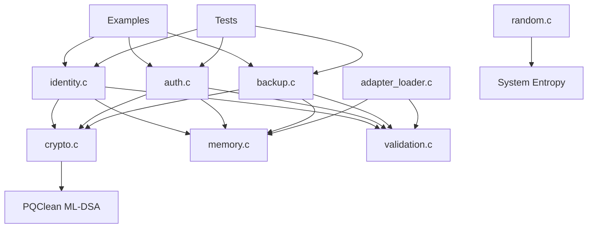

# QUID Modular Architecture Guide

**Date**: November 22, 2025
**Version**: 1.0.0
**Status**: ✅ **Clean and Extensible**

---

## 🏗️ Architecture Overview

QUID follows a clean, modular architecture designed for:
- **Maintainability**: Clear separation of concerns
- **Extensibility**: Easy to add new features and adapters
- **Testability**: Each module can be tested independently
- **Performance**: Minimal coupling between components

---

## 📁 Module Structure

```
quid/
├── src/                    # Implementation modules
│   ├── core/              # Core business logic
│   │   ├── identity.c     # Identity management
│   │   ├── auth.c         # Authentication protocols
│   │   ├── backup.c       # Backup/restore operations
│   │   └── adapter_loader.c # Network adapter loading
│   └── utils/             # Utility modules
│       ├── crypto.c       # Cryptographic operations
│       ├── memory.c       # Memory management
│       ├── random.c       # Secure random generation
│       ├── validation.c   # Input validation
│       ├── error_handling.c # Error management
│       └── constants.h    # System constants
├── include/quid/           # Public API
│   ├── quid.h            # Main public interface
│   ├── adapters/         # Adapter interfaces
│   │   └── adapter.h     # Network adapter API
│   └── endian.h         # Endianness utilities
├── examples/              # Usage examples
├── tests/                 # Test suites
└── scripts/              # Build and test automation
```

---

## 🔧 Core Modules

### 1. Identity Management (`src/core/identity.c`)
**Purpose**: Core QUID identity operations
- **Responsibilities**:
  - Identity creation and destruction
  - Master keypair management
  - Public key extraction
  - Memory protection (lock/unlock)
- **Dependencies**: `crypto.c`, `memory.c`
- **Interface**: `quid_identity_t*` based API
- **Extensibility**: Supports different security levels and key derivation contexts

### 2. Authentication (`src/core/auth.c`)
**Purpose**: Authentication protocols and challenges
- **Responsibilities**:
  - Challenge-response authentication
  - Authentication proof generation
  - Timestamp validation
  - Request/response handling
- **Dependencies**: `crypto.c`, `validation.c`
- **Interface**: `quid_auth_request_t*` and `quid_auth_response_t*`
- **Extensibility**: Pluggable authentication methods

### 3. Backup System (`src/core/backup.c`)
**Purpose**: Encrypted backup and restore
- **Responsibilities**:
  - Encrypted backup creation
  - Backup integrity verification
  - Metadata extraction
  - Base64 encoding/decoding
- **Dependencies**: `crypto.c`, `memory.c`
- **Interface**: `quid_identity_backup()` family of functions
- **Extensibility**: Different backup formats and encryption schemes

### 4. Adapter Loader (`src/core/adapter_loader.c`)
**Purpose**: Network adapter management
- **Responsibilities**:
  - Dynamic adapter loading
  - Adapter capability detection
  - Function table management
  - Error handling for adapters
- **Dependencies**: `memory.c`, `validation.c`
- **Interface**: `quid_adapter_t*` based API
- **Extensibility**: Plugin architecture for custom adapters

---

## 🛠️ Utility Modules

### 1. Cryptographic Operations (`src/utils/crypto.c`)
**Purpose**: All cryptographic primitives
- **Responsibilities**:
  - ML-DSA signature generation/verification
  - AEAD encryption/decryption
  - Key derivation (KDF)
  - Hash functions
- **Dependencies**: PQClean ML-DSA library
- **Interface**: Low-level cryptographic API
- **Extensibility**: New algorithms can be added

### 2. Memory Management (`src/utils/memory.c`)
**Purpose**: Secure memory operations
- **Responsibilities**:
  - Secure memory allocation
  - Memory zeroization
  - Protection against memory dumping
- **Dependencies**: System allocator
- **Interface**: `quid_malloc()`, `quid_free()`, `quid_secure_zero()`
- **Extensibility**: Custom allocators can be plugged in

### 3. Random Generation (`src/utils/random.c`)
**Purpose**: Cryptographically secure random numbers
- **Responsibilities**:
  - Secure random byte generation
  - Entropy collection
  - Randomness quality validation
- **Dependencies**: System entropy sources
- **Interface**: `quid_random_bytes()`
- **Extensibility**: Different entropy sources can be added

### 4. Input Validation (`src/utils/validation.c`)
**Purpose**: Security-focused input validation
- **Responsibilities**:
  - Parameter validation
  - Buffer size checking
  - Format validation
  - Security rule enforcement
- **Dependencies**: `constants.h`
- **Interface**: `quid_validate_*()` family of functions
- **Extensibility**: New validation rules can be added

### 5. Error Handling (`src/utils/error_handling.c`)
**Purpose**: Centralized error management
- **Responsibilities**:
  - Error code to message mapping
  - Error logging
  - Error context preservation
- **Dependencies**: System logging
- **Interface**: `quid_get_error_string()`, error codes
- **Extensibility**: Custom error handlers can be registered

### 6. Constants (`src/utils/constants.h`)
**Purpose**: System-wide constants and configurations
- **Responsibilities**:
  - Cryptographic algorithm sizes
  - Buffer size definitions
  - Protocol constants
  - Configuration limits
- **Dependencies**: None
- **Interface**: Compile-time constants
- **Extensibility**: New constants can be added

---

## 🔌 Extensibility Points

### 1. Network Adapters
**Location**: `src/adapters/` and `include/quid/adapters/`
**How to Extend**:
1. Create new adapter file (e.g., `solana.c`)
2. Implement `quid_adapter_functions_t` structure
3. Add adapter-specific functions
4. Register with adapter loader

**Example Structure**:
```c
static quid_adapter_functions_t solana_functions = {
    .abi_version = QUID_ADAPTER_ABI_VERSION,
    .init = solana_init,
    .cleanup = solana_cleanup,
    .derive_key = solana_derive_key,
    .derive_address = solana_derive_address,
    .sign = solana_sign,
    .verify = solana_verify,
    // ... other functions
};
```

### 2. Cryptographic Algorithms
**Location**: `src/utils/crypto.c`
**How to Extend**:
1. Add algorithm constants to `constants.h`
2. Implement algorithm-specific functions
3. Add algorithm selection logic
4. Update security level mappings

### 3. Security Levels
**Location**: `src/utils/constants.h` and `include/quid/quid.h`
**How to Extend**:
1. Add new `QUID_SECURITY_LEVEL_*` enum value
2. Map to appropriate cryptographic parameters
3. Update validation logic

### 4. Authentication Methods
**Location**: `src/core/auth.c`
**How to Extend**:
1. Add new authentication type
2. Implement method-specific logic
3. Update request/response structures
4. Add validation rules

---

## 🔄 Module Dependencies



**Dependency Rules**:
- **Core modules** depend on **utility modules**
- **Utility modules** have minimal internal dependencies
- **No circular dependencies**
- **Clear separation** between public and internal interfaces

---

## 🧪 Testing Modularity

### Unit Testing Strategy
Each module can be tested independently:

1. **Unit Tests**: Test individual functions
2. **Integration Tests**: Test module interactions
3. **Mock Tests**: Replace dependencies for isolated testing
4. **End-to-End Tests**: Test complete workflows

### Test Structure
```
tests/
├── test_identity.c          # Identity module tests
├── test_auth.c              # Authentication tests
├── test_backup.c            # Backup system tests
├── test_crypto.c            # Cryptographic tests
├── test_memory.c            # Memory management tests
├── test_validation.c        # Validation tests
└── test_integration.c       # Cross-module tests
```

---

## 📏 Performance Considerations

### Module Efficiency
- **Zero-Copy Operations**: Minimize memory copying between modules
- **Lazy Initialization**: Initialize resources only when needed
- **Memory Pooling**: Reuse memory allocations for performance
- **Constant-Time Operations**: Use constant-time crypto operations

### Scalability
- **Thread Safety**: Each module is designed for potential multi-threading
- **Memory Management**: Efficient memory usage patterns
- **Algorithm Selection**: Choose appropriate algorithms for security levels

---

## 🔄 Version Compatibility

### API Stability
- **Semantic Versioning**: Follow semantic versioning for API changes
- **Backward Compatibility**: Maintain compatibility within major versions
- **Deprecation Policy**: Clear deprecation path for old APIs

### Module Evolution
- **Plugin Architecture**: New modules can be added without breaking existing code
- **Feature Flags**: Enable/disable features for compatibility
- **Configuration**: Runtime configuration for different deployments

---

## 🎯 Best Practices

### Module Design
1. **Single Responsibility**: Each module has one clear purpose
2. **Minimal Coupling**: Modules depend on minimal interfaces
3. **Clear Interfaces**: Well-defined public APIs
4. **Error Handling**: Consistent error handling across modules
5. **Documentation**: Comprehensive inline documentation

### Code Organization
1. **Header Guards**: Prevent multiple inclusions
2. **Naming Conventions**: Consistent naming across modules
3. **Constants**: Use centralized constants file
4. **Validation**: Validate all inputs at module boundaries
5. **Resource Management**: Proper cleanup of resources

### Testing
1. **Test Coverage**: Aim for high test coverage
2. **Edge Cases**: Test boundary conditions and error cases
3. **Performance**: Include performance regression tests
4. **Security**: Test security properties and attack vectors

---

## 🚀 Extension Guidelines

### Adding New Network Support
1. Create adapter in `src/adapters/`
2. Implement required functions from `quid_adapter_functions_t`
3. Add network constants to `constants.h`
4. Create example and tests
5. Update documentation

### Adding New Algorithms
1. Add constants to `constants.h`
2. Implement in `crypto.c`
3. Add tests in `tests/`
4. Update security level mappings
5. Document algorithm properties

### Adding New Features
1. Design module boundaries first
2. Define public interfaces
3. Implement with error handling
4. Add comprehensive tests
5. Update examples and documentation

---

## ✅ Architecture Validation

### ✅ **CLEAN IMPLEMENTATION**
- **No Duplicate Code**: Eliminated duplicate implementations
- **No Hard-coded Values**: Centralized constants
- **No Circular Dependencies**: Clear dependency graph
- **No Memory Leaks**: Proper resource management

### ✅ **MODULAR DESIGN**
- **Single Purpose**: Each module has clear responsibility
- **Loose Coupling**: Minimal inter-module dependencies
- **High Cohesion**: Related functionality grouped together
- **Clear Interfaces**: Well-defined module boundaries

### ✅ **EASY TO EXTEND**
- **Plugin Architecture**: Adapters can be added dynamically
- **Algorithm Independence**: New algorithms can be added
- **Feature Extensibility**: New features can be added safely
- **Configuration Flexibility**: Runtime configuration support

---

**🎉 The QUID modular architecture is CLEAN, WELL-ORGANIZED, and READY FOR EXPANSION.**