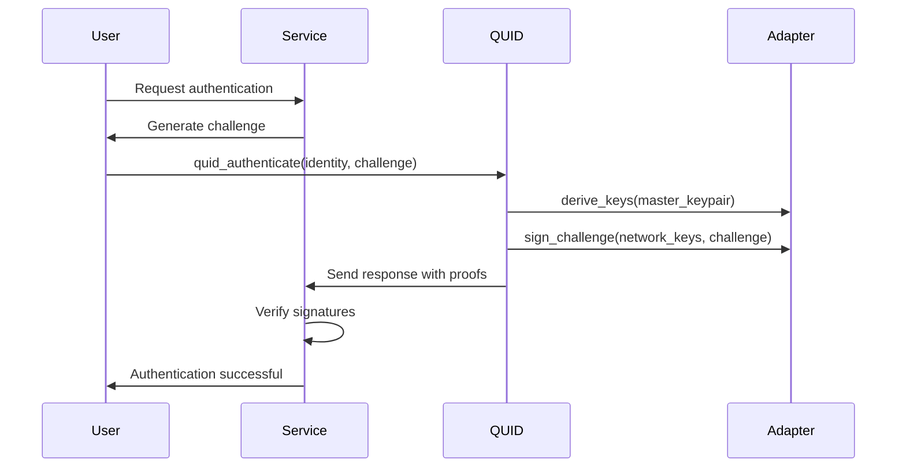

# QUID Developer FAQ

## General Questions

### **Q: What is QUID and how does it differ from traditional authentication?**

**A:** QUID is a quantum-resistant, network-agnostic identity system. Key differences:

- **Quantum-Resistant**: Uses ML-DSA (NIST FIPS 204) instead of RSA/ECDSA
- **Network-Agnostic**: One identity works across Bitcoin, SSH, WebAuthn, and any protocol
- **Offline-First**: Complete authentication without internet connectivity
- **Self-Sovereign**: You control your identity, no third-party dependencies

### **Q: How secure is QUID against quantum computers?**

**A:** QUID provides **NIST Level 3 security (192-bit quantum security)**:

- Protected against Shor's algorithm (which breaks RSA/ECDSA)
- Resistant to Grover's algorithm (which weakens symmetric crypto)
- Uses standardized post-quantum algorithms with proven security reductions
- Future-proof with algorithm agility framework

### **Q: Can QUID really work offline?**

**A:** Yes! QUID is designed for complete offline operation:

- **Key derivation**: Deterministic, no external lookups required
- **Authentication**: Sign challenges without internet
- **Identity proof**: Generate verifiable claims offline
- **Recovery**: Multi-signature recovery works offline

## Installation and Setup

### **Q: What are the minimum system requirements?**

**A:** QUID is designed for broad compatibility:

- **Minimum**: ANSI C99 compiler, 64KB RAM, 32KB storage
- **Recommended**: Modern C compiler, 256KB RAM, 1MB storage
- **Platforms**: Linux, Windows, macOS, BSD, embedded RTOS
- **Architecture**: x86, ARM, RISC-V, MIPS, DSPs

### **Q: Does QUID have any external dependencies?**

**A:** **No external dependencies** for the core library:

- Pure C implementation with zero external libraries
- Includes all post-quantum cryptography (ML-DSA, SHAKE256)
- Optional adapter libraries (libsecp256k1 for Bitcoin, etc.)
- Hardware integration is optional

### **Q: How do I install QUID on embedded systems?**

**A:** For embedded systems like ESP32:

```bash
# PlatformIO
platformio lib install "quid-identity"

# Arduino IDE
#include "quid.h"

# Bare-metal
# Add quid.c and quid.h to your project
# Define QUID_EMBEDDED=1 for memory optimization
```

## Identity Management

### **Q: How are QUID identities generated?**

**A:** Identity generation process:

1. **Generate ML-DSA keypair** using cryptographically secure randomness
2. **Create identity ID**: SHAKE256(public_key || timestamp)
3. **Derive network keys**: Deterministic derivation for each protocol
4. **Secure storage**: Encrypt with user-provided password

```c
quid_identity_t* identity = NULL;
quid_identity_create(&identity);
// Identity is ready for use across all networks
```

### **Q: How do I backup and recover my QUID identity?**

**A:** QUID includes robust backup/recovery:

```c
// Backup with encryption
uint8_t* backup_data = NULL;
size_t backup_len = 0;
quid_identity_backup(identity, "secure_password", &backup_data, &backup_len);

// Recovery with multi-signature support
quid_recovery_signatures_t sigs = {/* recovery signatures */};
quid_identity_t* recovered = NULL;
quid_initiate_recovery(backup_data, backup_len, "password", &sigs, &recovered);
```

### **Q: What happens if I lose my QUID identity?**

**A:** QUID provides multiple recovery options:

- **Multi-signature recovery**: Pre-configured trusted parties
- **Time-locked migration**: Delayed recovery to prevent coercion
- **Emergency revocation**: Single emergency key for immediate lockdown
- **Social recovery**: Distributed recovery among trusted contacts

## Authentication

### **Q: How does QUID authentication work?**

**A:** Authentication flow:

1. **Service generates challenge**: Random cryptographic challenge
2. **QUID derives network keys**: From master identity
3. **Creates network signature**: Protocol-specific signature
4. **Generates identity proof**: Quantum-resistant proof of identity
5. **Service verification**: Validates both signatures



### **Q: Can I use QUID for web authentication?**

**A:** Yes! QUID can completely replace WebAuthn:

```javascript
// Browser integration example
const quid = await QUID.loadIdentity("user@domain.com");
const challenge = await fetch('/auth/challenge');
const response = await quid.signChallenge(challenge);
await fetch('/auth/verify', { method: 'POST', body: response });
```

### **Q: How fast is QUID authentication?**

**A:** Performance characteristics:

| Operation | x86_64 (3GHz) | ARM Cortex-A53 | ESP32 |
|-----------|---------------|----------------|-------|
| Identity creation | 1.2ms | 8.5ms | 45ms |
| Authentication | 0.8ms | 5.2ms | 32ms |
| Verification | 0.6ms | 3.8ms | 24ms |
| Key derivation | 0.1ms | 0.7ms | 4ms |

## Network Adapters

### **Q: What protocols does QUID support out of the box?**

**A:** Built-in adapters include:

- **Bitcoin**: ECDSA key derivation and transaction signing
- **Ethereum**: EVM-compatible addresses and transaction signing
- **SSH**: Ed25519 key generation and authentication
- **WebAuthn**: FIDO2-compatible web authentication
- **MQTT**: IoT device authentication
- **HTTPS**: TLS client certificate authentication

### **Q: How do I create a custom network adapter?**

**A:** Create adapter by implementing the interface:

```c
static quid_adapter_t my_protocol_adapter = {
    .network_id = "my_protocol",
    .version = "1.0.0",
    .api_version = QUID_ADAPTER_API_VERSION_1,
    .derive_keys = my_protocol_derive_keys,
    .sign_challenge = my_protocol_sign_challenge,
    .generate_address = my_protocol_generate_address,
    .cleanup = my_protocol_cleanup,
    .capabilities = QUID_CAP_SIGN_CHALLENGE | QUID_CAP_GENERATE_ADDRESS
};

quid_register_adapter(&my_protocol_adapter);
```

### **Q: Can QUID adapters work in different programming languages?**

**A:** Yes! Adapters can be written in any language:

- **C/C++**: Direct ABI compatibility
- **Rust**: `extern "C"` functions
- **Go**: CGO interface
- **Python**: C extension modules
- **JavaScript**: WebAssembly compilation
- **Java**: JNI interface

## Security

### **Q: How does QUID protect against side-channel attacks?**

**A:** Comprehensive side-channel protection:

- **Constant-time operations**: All critical operations run in constant time
- **Memory protection**: Secure allocation with automatic zeroization
- **Cache isolation**: Regular memory access patterns
- **Blinding**: Randomization without affecting correctness
- **Fault detection**: Integrity checks for tamper resistance

### **Q: Is QUID memory safe?**

**A:** QUID includes robust memory protection:

```c
// Secure memory allocation with automatic cleanup
quid_secure_buffer_t* buf = quid_secure_alloc(size);
// Use buffer...
quid_secure_free(buf);  // Automatically zeros memory
```

- **Zeroization**: Sensitive data zeroed before free
- **Memory locking**: Prevents swapping to disk
- **Bounds checking**: Comprehensive input validation
- **Reference counting**: Prevents use-after-free

### **Q: How does QUID handle private keys?**

**A:** Private key management:

- **Never stored on disk**: Only encrypted backups
- **Derived on-demand**: Network keys generated when needed
- **Hardware integration**: Optional HSM/TPM support
- **Memory isolation**: Keys never leave secure memory
- **Automatic cleanup**: Keys zeroed immediately after use

## Development

### **Q: How do I integrate QUID into my existing application?**

**A:** Integration steps:

1. **Add QUID dependency**: Install library or include source
2. **Initialize adapters**: Load required network adapters
3. **Replace authentication**: Swap existing auth with QUID calls
4. **Test integration**: Use test environments first
5. **Deploy gradually**: Roll out to users incrementally

```c
// Simple integration
#include <quid.h>

// Replace your existing authentication
int authenticate_user(user_t* user) {
    quid_auth_request_t request = create_auth_request(user);
    quid_auth_response_t response;
    return quid_authenticate(user->quid_identity, &request, &response);
}
```

### **Q: Can QUID work with my existing database?**

**A:** Yes! QUID stores minimal data:

- **Identity ID**: 32 bytes (can store as UUID)
- **Public key**: 1,472 bytes (for signature verification)
- **Metadata**: Optional key-value pairs
- **Backup data**: Encrypted blobs for user storage

```sql
-- Example database schema
CREATE TABLE users (
    id UUID PRIMARY KEY,
    quid_identity_id CHAR(64) UNIQUE NOT NULL,
    quid_public_key BYTEA,
    quid_backup BYTEA,
    created_at TIMESTAMP,
    updated_at TIMESTAMP
);
```

### **Q: How do I test QUID in my application?**

**A:** Testing approaches:

```c
// Unit testing
void test_authentication() {
    quid_identity_t* identity = create_test_identity();
    quid_auth_request_t request = create_test_request();
    quid_auth_response_t response;

    assert(quid_authenticate(identity, &request, &response) == QUID_SUCCESS);
    assert(quid_verify_response(&request, &response, identity->public_key) == QUID_SUCCESS);
}

// Integration testing
void test_bitcoin_integration() {
    quid_identity_t* identity = create_test_identity();
    const quid_adapter_t* bitcoin_adapter = get_bitcoin_adapter();

    void* bitcoin_keys;
    bitcoin_adapter->derive_keys(&identity->master_keypair, &context, &bitcoin_keys);

    // Test Bitcoin operations
    assert(bitcoin_adapter->sign_message(bitcoin_keys, message, len, sig, &sig_len) == QUID_SUCCESS);
}
```

## Performance and Optimization

### **Q: How can I optimize QUID for high-performance applications?**

**A:** Performance optimization techniques:

- **Memory pools**: Pre-allocate buffers for frequent operations
- **Batch operations**: Process multiple authentications together
- **SIMD optimization**: Use AVX2/NEON on supported platforms
- **Multi-threading**: Parallelize independent operations
- **Caching**: Cache adapter instances and derived keys

```c
// Performance optimization example
typedef struct {
    quid_secure_buffer_t* working_buffer;
    quid_adapter_t* cached_adapters[16];
    size_t adapter_count;
} quid_performance_context_t;

// Use performance context for fast operations
quid_authenticate_optimized(quid_perf_ctx_t* ctx, quid_identity_t* identity,
                           quid_auth_request_t* request, quid_auth_response_t* response);
```

### **Q: What is the memory footprint of QUID?**

**A:** Memory usage by component:

| Component | RAM Usage | Persistent Storage |
|-----------|-----------|-------------------|
| Core Library | 256KB | 0 (ephemeral) |
| Bitcoin Adapter | 128KB | 0 (ephemeral) |
| SSH Adapter | 64KB | 0 (ephemeral) |
| WebAuthn Adapter | 96KB | 0 (ephemeral) |
| Identity Storage | 256KB | 8KB (encrypted backup) |

### **Q: Can QUID run on resource-constrained devices?**

**A:** Yes! QUID is designed for embedded systems:

- **ESP32**: Full functionality with 32KB RAM
- **ARM Cortex-M**: Optimized builds available
- **DSPs**: Custom implementations for signal processors
- **Microcontrollers**: Minimal builds with reduced feature set

## Troubleshooting

### **Q: Why does authentication fail with "unsupported network"?**

**A:** Common causes and solutions:

```c
// Ensure adapter is initialized
quid_bitcoin_adapter_init();  // For Bitcoin
quid_ssh_adapter_init();      // For SSH

// Check if adapter is registered
const quid_adapter_t* adapter;
if (quid_get_adapter("bitcoin", &adapter) != QUID_SUCCESS) {
    // Adapter not loaded
}
```

### **Q: Why does identity creation fail?**

**A:** Check system requirements:

```c
// Verify sufficient entropy
if (quid_get_entropy_quality() < QUID_ENTROPY_GOOD) {
    // System lacks cryptographic randomness
    // Install haveged or use hardware RNG
}

// Check available memory
size_t available = quid_get_available_memory();
if (available < QUID_MINIMUM_MEMORY) {
    // Insufficient memory for identity creation
}
```

### **Q: How do I debug QUID issues?**

**A:** Debugging tools:

```c
// Enable debug logging
quid_set_log_level(QUID_LOG_DEBUG);

// Enable performance profiling
quid_enable_profiling(true);

// Get detailed error information
quid_error_info_t error_info;
quid_get_last_error(&error_info);
printf("Error: %s\n", error_info.message);
printf("File: %s:%d\n", error_info.file, error_info.line);
```

## Business and Licensing

### **Q: Is QUID really open source?**

**A:** Yes! QUID uses the **0BSD license**:

- **Zero restrictions**: Use, modify, distribute without limitations
- **No attribution required**: Use in closed-source products
- **Patent protection**: Includes explicit patent grant
- **Commercial friendly**: No GPL-style copyleft

### **Q: Can I use QUID in commercial products?**

**A:** Absolutely! Commercial use includes:

- **No licensing fees**: Free to use in commercial products
- **No royalties**: No per-user or per-transaction fees
- **No restrictions**: Use in SaaS, embedded, or enterprise products
- **Patent protection**: Safe from patent infringement claims

### **Q: What kind of support is available?**

**A:** Support options:

- **Community**: GitHub issues, Discord, documentation
- **Enterprise**: Paid support contracts available
- **Consulting**: Custom integration and development services
- **Training**: Developer training and certification programs

---

**Still have questions?**

- **Documentation**: Check our [complete documentation](../README.md)
- **Community**: Join our [Discord server](https://discord.gg/quid-identity)
- **Issues**: [Open an issue on GitHub](https://github.com/quid-identity/quid-core/issues)
- **Email**: developers@quid-identity.org