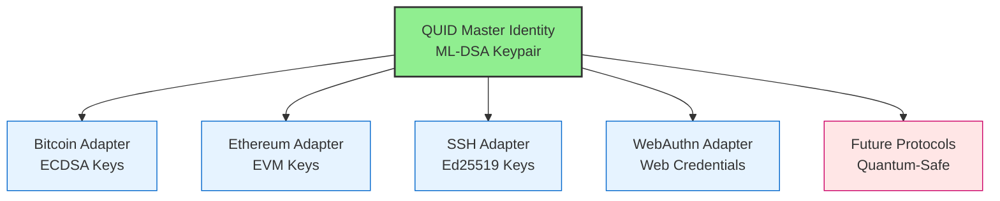
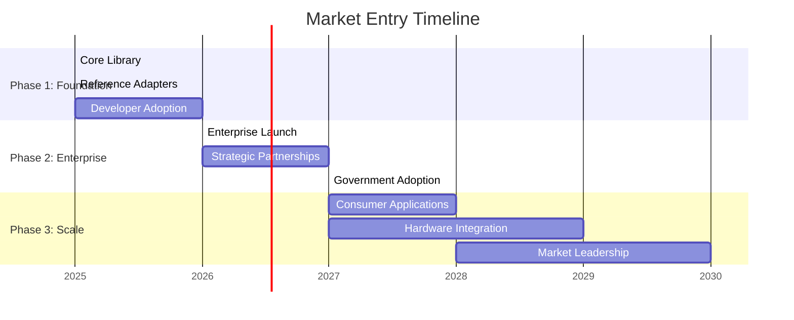

# QUID: Quantum-Resistant Universal Identity
**Whitepaper v2.0 - The Standard for Post-Quantum Digital Identity**

---

## Executive Summary

QUID (Quantum-Resistant Universal Identity) is the first truly **network-agnostic**, **offline-first**, and **quantum-resistant** digital identity system. One master identity works across Bitcoin, SSH, WebAuthn, and any protocol—future-proof against quantum computers.

**The Problem**: Digital identity is fragmented and vulnerable. Current systems will be broken by quantum computers, while users juggle dozens of separate identities across platforms.

**The Solution**: QUID's revolutionary three-layer architecture creates a single, quantum-resistant master identity that derives network-specific keys on-demand, working offline without any infrastructure.

---

## The Quantum Threat is Real

- **Timeline**: 5-10 years to practical quantum computers
- **Impact**: RSA, ECDSA, and Ed25519 will be broken by Shor's algorithm
- **"Harvest Now, Decrypt Later"**: State-sponsored data collection already underway

> *"When quantum computers become available, all existing encrypted communications will be readable."* - NSA Cybersecurity Advisory

---

## QUID Architecture: One Identity, All Networks

### Core Innovation

**Single Master Identity**: One ML-DSA (CRYSTALS-Dilithium) keypair generates deterministic keys for any network through protocol-specific adapters.

**Quantum-Resistant by Design**: Uses only NIST-standardized post-quantum algorithms:
- **ML-DSA** (CRYSTALS-Dilithium) for signatures - NIST FIPS 204
- **ML-KEM** (CRYSTALS-Kyber) for key exchange - NIST FIPS 203
- **SHAKE256** for hashing - NIST FIPS 205

**Network Agnostic**: Clean separation between core identity and network-specific adapters.

---

## Technical Performance

| Operation | x86_64 | ARM Cortex | ESP32 | Memory |
|-----------|--------|------------|-------|---------|
| Key Generation | 1.2ms | 8.5ms | 45ms | 256KB |
| Authentication | 0.8ms | 5.2ms | 32ms | 128KB |
| Key Derivation | 0.1ms | 0.7ms | 4ms | 32KB |

**Zero Dependencies**: Pure C implementation works on any platform with a C compiler.

---

## Market Opportunity: $68.5B by 2030

| Market Segment | 2024 Size | 2030 Projection | Growth |
|----------------|-----------|-----------------|---------|
| Identity Management | $15.2B | $28.7B | 8.4% CAGR |
| Multi-Factor Auth | $12.8B | $24.1B | 9.2% CAGR |
| Blockchain Wallets | $6.3B | $11.8B | 10.1% CAGR |
| Enterprise Auth | $8.9B | $3.9B | 7.8% CAGR |

**Quantum Security Premium**: +40-60% market expansion as quantum computing advances.

---

## Competitive Advantage

| Feature | QUID | Competitors |
|---------|------|-------------|
| **Quantum Resistant** | ✅ | ❌ |
| **Network Agnostic** | ✅ | ❌ |
| **Offline First** | ✅ | ❌/Limited |
| **Self-Custodial** | ✅ | ❌/Limited |
| **Zero Dependencies** | ✅ | ❌ |

**First Mover Advantage**: Only truly network-agnostic quantum-resistant identity solution.

---

## Business Model: Open Source + Enterprise

### Revenue Streams
1. **Enterprise Support**: $50K-500K/year contracts
2. **Adapter Certification**: $10K-50K per adapter
3. **Hardware Integration**: $100K-1M licensing deals
4. **Consulting Services**: $200-500/hour implementation

### 5-Year Revenue Projection
- Year 1: $0 (Development)
- Year 2: $500K (Early adopters)
- Year 3: $2.5M (Market expansion)
- Year 4: $8.0M (Mainstream adoption)
- Year 5: $20.0M (Market leadership)

---

## Roadmap to Market Leadership

### Key Milestones
- **Phase 1** (2025): Core library, reference adapters, 1K+ developers
- **Phase 2** (2026-27): 10+ enterprise customers, strategic partnerships
- **Phase 3** (2028+): Consumer adoption, hardware integration, market leadership

---

## Use Cases

### 🌐 Blockchain & Cryptocurrency
- **Quantum-Safe Trading**: Protect $15B+ in crypto assets from quantum attacks
- **Multi-Chain Identity**: One identity for Bitcoin, Ethereum, and future chains
- **Institutional Custody**: Quantum-resistant custody for institutional investors

### 🔐 Enterprise Authentication
- **Quantum-Ready IAM**: Future-proof identity and access management
- **Zero Trust Architecture**: Eliminate trusted third parties
- **Regulatory Compliance**: Meet upcoming NIST quantum security requirements

### 🏛️ Government & Critical Infrastructure
- **National Security**: Protect classified systems and communications
- **Election Security**: Quantum-resistant voting and identity verification
- **Critical Infrastructure**: Secure power grids, finance, healthcare systems

### 🌱 IoT & Embedded Devices
- **Device Identity**: Quantum-resistant authentication for 1B+ IoT devices
- **Supply Chain**: Secure manufacturing and device lifecycle management
- **15+ Year Lifecycle**: Devices remain secure throughout their lifespan

---

## Investment Opportunity

### The Ask: $8M Seed Round

**Use of Funds:**
- **Core Development** (45%): $3.6M - Library implementation and security audit
- **Ecosystem Development** (25%): $2.0M - Community building and adapters
- **Business Development** (20%): $1.6M - Sales, marketing, partnerships
- **Operations** (10%): $0.8M - Legal, infrastructure, admin

### Milestones to Series A
- Core library security audit completion
- 5,000+ developer adoption
- 10+ paying enterprise customers
- $500K ARR

### Why Invest in QUID?

1. **Perfect Market Timing**: Quantum threat creates immediate urgency
2. **Massive Market**: $68.5B addressable market by 2030
3. **Technical Moat**: Revolutionary architecture with significant barriers
4. **First-Mover Advantage**: Only truly network-agnostic quantum-resistant identity

---

## The Vision: TCP/IP of Digital Identity

Just as TCP/IP became the universal standard for network communication, QUID will become the **universal standard for digital identity** in the post-quantum era.

**One Identity, All Networks, Quantum-Secure** 🚀

---

*Contact: [investors@quid-identity.org](mailto:investors@quid-identity.org)*
*Documentation: [quid-identity.org](https://quid-identity.org)*

---

*"The question is not IF quantum computers will break current cryptography, but WHEN. QUID provides the answer."*